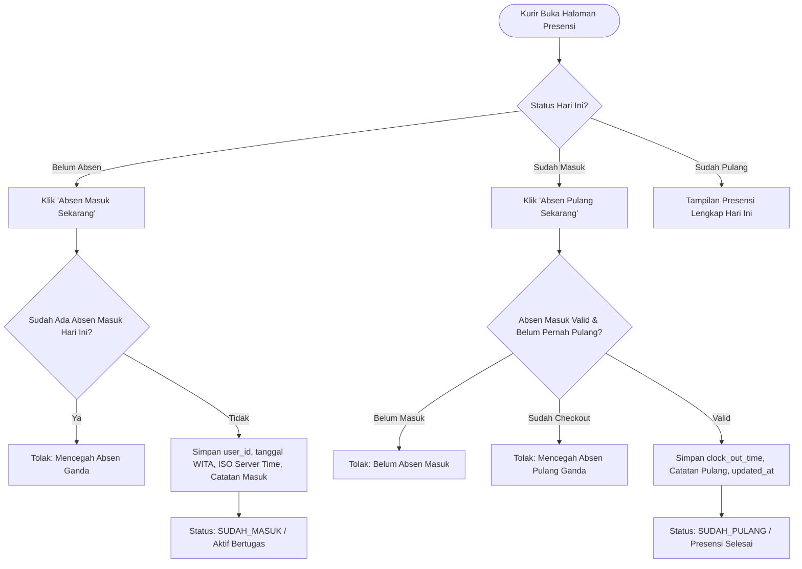

# PHASE 6: ATTENDANCE SYSTEM ARCHITECTURE & IMPLEMENTATION
**JetFood Polman — Courier Operations Web App**

---

## 1. Overview & Purpose
Phase 6 implements the complete attendance and shift tracking subsystem for field couriers and operations administrators at JetFood Polman.
The system guarantees:
- **Zero Client Tampering:** Server-authoritative time and date derived strictly on the backend.
- **WITA Timezone Standardization:** All dates and timestamps are aligned with `Asia/Makassar` (UTC+8).
- **Anti-Duplicate Guarantees:** Prevents double check-in and double check-out per courier per calendar day.
- **Role-Based Isolation:** Field couriers access solely their own logs; administrators monitor company-wide attendance and perform corrections with a mandatory audit trail.
- **Future-Ready Boundary:** Strict adherence to non-goals (no GPS geolocation or selfie verification in V1).

---

## 2. Core Attendance Lifecycle & Rules

### Business Rules
1. **Pencatatan Masuk Otomatis:**
   - `courier_id`: Diekstrak langsung dari sesi autentikasi (`session.courier.id`), bukan dari input formulir.
   - `date`: Dihitung otomatis di server dalam format `YYYY-MM-DD` zona waktu WITA (`Asia/Makassar`).
   - `clock_in_time`: Timestamp ISO UTC server, diformat untuk tampilan sebagai `HH:mm WITA`.
   - Kurir dilarang memanipulasi tanggal atau jam secara manual.
2. **Pencegahan Absen Masuk Ganda (Anti-Double Check-in):**
   - Sistem menolak pembuatan record presensi baru jika pada tanggal WITA yang sama kurir tersebut telah memiliki baris presensi.
3. **Pencatatan Pulang (Clock Out):**
   - Hanya dapat dilakukan apabila sudah terdapat data absen masuk pada hari yang bersangkutan.
   - Menolak eksekusi jika `clock_out_time` telah terisi (Anti-Double Check-out).
4. **Koreksi Manual Admin & Audit Trail:**
   - Admin berhak mengoreksi jam masuk/pulang kurir apabila terjadi kendala operasional lapangan.
   - Setiap koreksi **wajib** menyertakan alasan (`reason`).
   - Sistem membubuhkan tag audit permanen pada catatan: `[Koreksi Admin oleh <email> pada <WITA date>: <reason>]`.

---

## 3. Implementation Details

### A. Server Actions (`src/actions/attendance.ts`)
- `clockInAction(notes?: string)`: Validasi anti-duplicate check-in, simpan record presensi masuk dengan timezone WITA.
- `clockOutAction(notes?: string)`: Validasi prasyarat clock-in, anti double clock-out, simpan waktu kepulangan.
- `getTodayAttendanceForCourier(courierId: string)`: Mengembalikan state terkini (`BELUM_ABSEN`, `SUDAH_MASUK`, `SUDAH_PULANG`) untuk dashboard dan kartu presensi.
- `getCourierAttendanceHistory()`: Query terisolasi khusus data milik kurir yang login.
- `getAdminAttendanceList(options?: { date?: string; courierId?: string })`: Monitoring presensi seluruh kurir dengan filter tanggal & kurir.
- `adminCorrectAttendanceAction(attendanceId, data: { clockInTime, clockOutTime, reason })`: Koreksi manual dengan audit trail terverifikasi.

### B. Courier UI (`src/app/(courier)/courier/attendance/page.tsx` & `AttendanceCard`)
- Kartu interaktif berbasis React 19 Client Component (`useTransition`).
- Indikator real-time zona waktu WITA (UTC+8).
- Form input catatan opsional (kondisi armada / catatan rute).
- Banner peringatan keamanan sistem: pencatatan server-side anti-manipulasi.
- Daftar "Riwayat Presensi Saya" dengan badge status dan visualisasi log audit bila ada koreksi admin.

### C. Admin UI (`src/app/(admin)/admin/attendance/page.tsx` & Components)
- **Ringkasan Metrik:**
  - Presensi Masuk (Total Hadir Hari Ini)
  - Sedang Bertugas di Lapangan (Belum Checkout)
  - Selesai Pulang (Checkout Lengkap)
- **AttendanceFilter:** Filter dinamis tanggal WITA (datepicker) dan dropdown pilihan kurir.
- **AttendanceTable:** Tabel detail jam masuk, jam pulang, catatan, dan badge audit koreksi.
- **AttendanceCorrectionModal:** Dialog koreksi jam masuk/pulang kurir dengan validasi wajib alasan audit trail.

---

## 4. Verification & Testing

### Automated Test Suite (`scripts/test-phase6-attendance.mjs`)
10 skenario pengujian komprehensif dijalankan dan lulus 100%:
1. `TEST 1: Courier Absen Masuk (Clock In)` &rarr; user_id, tanggal, waktu WITA otomatis tersimpan.
2. `TEST 2: Double Check-in Prevention` &rarr; Upaya absen kedua pada hari yang sama ditolak.
3. `TEST 3: Check-out Before Check-in Prevention` &rarr; Upaya checkout tanpa absen masuk ditolak.
4. `TEST 4: Courier Absen Pulang (Clock Out)` &rarr; Checkout tersimpan dengan timestamp server.
5. `TEST 5: Double Check-out Prevention` &rarr; Checkout berulang ditolak.
6. `TEST 6: Timezone Verification (Asia/Makassar UTC+8)` &rarr; Konversi waktu dan tanggal WITA presisi.
7. `TEST 7: Session & Role Access Control` &rarr; Pengguna tanpa login, kurir vs admin diisolasi ketat.
8. `TEST 8: Courier Personal History Isolation` &rarr; Kurir A tidak dapat melihat riwayat Kurir B.
9. `TEST 9: Admin Attendance Monitoring & Filtering` &rarr; Filter tanggal dan kurir berfungsi akurat.
10. `TEST 10: Admin Manual Correction with Audit Trail` &rarr; Perubahan admin mewajibkan alasan dan membubuhkan email admin + timestamp WITA.

### Regression Test Matrix
- `test-auth-rbac.mjs` &rarr; **PASSED (7/7 tests)**
- `test-phase3-admin.mjs` &rarr; **PASSED (7/7 tests)**
- `test-phase4-master-data.mjs` &rarr; **PASSED (8/8 tests)**
- `test-phase5-courier.mjs` &rarr; **PASSED (7/7 tests)**
- `test-phase6-attendance.mjs` &rarr; **PASSED (10/10 tests)**

### Code Quality & Build Checks
- `npm run lint` &rarr; **0 errors, 0 warnings**
- `npm run typecheck` &rarr; **0 TypeScript errors**
- `npm run build` &rarr; **Next.js 16.3.8 Turbopack build SUCCESS** (semua route statis dan dinamis terkompilasi optimal).
