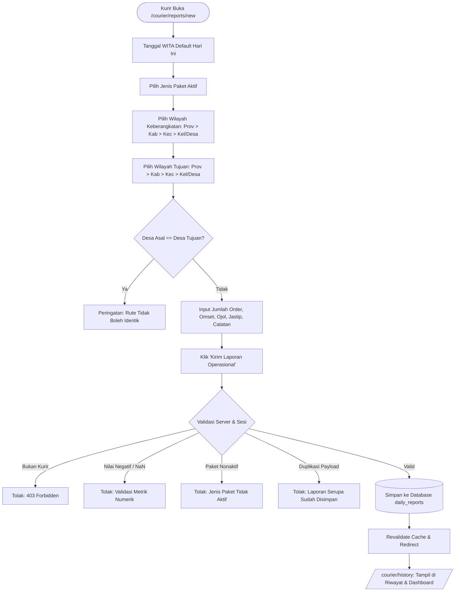

# PHASE 7: DAILY OPERATIONAL REPORT ARCHITECTURE & IMPLEMENTATION
**JetFood Polman — Courier Operations Web App**

---

## 1. Overview & Purpose
Phase 7 introduces the core operational reporting engine for JetFood Polman field couriers. Couriers record their daily routes, package types, parcel order volumes, revenue (omset), and supplementary services (Ojol & Jastip) directly from their mobile or desktop devices.

The system ensures:
- **Hierarchical Regional References:** Full cascade selection (Province &rarr; Regency/City &rarr; District &rarr; Village) for both departure and destination.
- **Route Non-Identity Enforcement:** Departure and destination villages cannot be identical.
- **Strict Numeric Validations:** Non-negative integer counts and non-negative currency amounts (NaN checks included).
- **Master Data Binding:** Couriers can only select active package types managed by Administrators.
- **Authoritative Ownership & Lockout:** Couriers can only create and edit their own reports on the active operational date (WITA). Historical records from past days are locked for couriers to safeguard accounting integrity.
- **Anti-Duplicate Safeguards:** Rapid resubmissions of identical routes and payloads are rejected.

---

## 2. Operational Report Data Flow & Architecture

---

## 3. Business Rules & Validations

1. **Struktur Entitas Regional:**
   - Disimpan secara hierarkis dengan referensi ID dan nama resmi:
     - `origin_province_id`, `origin_province_name`
     - `origin_regency_id`, `origin_regency_name`
     - `origin_district_id`, `origin_district_name`
     - `origin_village_id`, `origin_village_name`
     - `dest_province_id`, `dest_province_name`
     - `dest_regency_id`, `dest_regency_name`
     - `dest_district_id`, `dest_district_name`
     - `dest_village_id`, `dest_village_name`
   - String display rute (misal `Manding, Polewali → Sidodadi, Wonomulyo`) dibentuk dinamis dan tidak menjadi single source of truth database.
2. **Validasi Anti-Rute Identik:**
   - `origin_village_id <> dest_village_id` ditegakkan pada tingkat schema database check constraint dan server action.
3. **Validasi Nilai Numerik:**
   - `order_count >= 0` (integer)
   - `omset >= 0.00` (numeric Rupiah)
   - `ojol_count >= 0`, `ojol_amount >= 0.00`
   - `jastip_count >= 0`, `jastip_amount >= 0.00`
   - Nilai `NaN` atau string invalid ditolak langsung oleh schema validasi.
4. **Aturan Hak Milik (Ownership) & Pengeditan:**
   - **Kurir:** Hanya dapat melihat dan mengubah laporan milik dirinya sendiri (`courier_id = session.courier.id`).
   - **Kunci Tanggal Lampau:** Kurir hanya diizinkan mengedit laporan pada tanggal kalender operasional yang sama (hari ini WITA). Laporan tanggal lampau berstatus read-only bagi kurir.
   - **Penghapusan (No Hard-Delete):** Kurir secara tegas tidak diberikan hak delete pada `daily_reports` untuk mencegah perusakan data historis.
   - **Admin:** Memiliki wewenang peninjauan dan koreksi administratif di atas data seluruh kurir.

---

## 4. Components & Pages Implemented

- `src/actions/daily-reports.ts`:
  - `createDailyReportAction()`
  - `updateDailyReportAction()`
  - `getCourierDailyReports()`
  - `getDailyReportById()`
- `src/components/courier/report-region-cascade.tsx`:
  - Dropdown bertingkat 4 level dengan auto-cascade dan indikator loading per level.
- `src/components/courier/daily-report-form.tsx`:
  - Formulir reaktif terintegrasi dengan validasi rute identik real-time dan live currency preview format Rupiah.
- `src/app/(courier)/courier/reports/new/page.tsx`:
  - Halaman pembuatan laporan operasional kurir baru.
- `src/app/(courier)/courier/reports/[id]/edit/page.tsx`:
  - Halaman pengeditan laporan dengan proteksi ownership dan kunci tanggal lampau.
- `src/app/(courier)/courier/history/page.tsx`:
  - Halaman riwayat operasional lengkap dengan kartu ringkasan (Total Rute, Total Order, Total Omset), filter tanggal, dan tombol edit.

---

## 5. Verification & Testing

### Automated Test Suite (`scripts/test-phase7-reports.mjs`)
10 skenario pengujian komprehensif dijalankan dan lulus 100%:
1. `TEST 1: Valid Report Submission` &rarr; Disimpan sukses dengan metrik lengkap.
2. `TEST 2: Identical Route Validation` &rarr; Asal & tujuan desa yang sama ditolak.
3. `TEST 3: Negative & Invalid Numeric Metrics` &rarr; Order negatif, omset negatif, dan NaN ditolak.
4. `TEST 4: Missing Required Fields` &rarr; Missing origin, destination, dan package type ditolak.
5. `TEST 5: Inactive Package Type Selection` &rarr; Paket non-aktif ditolak server validation.
6. `TEST 6: Unauthorized User Access` &rarr; Akses tanpa sesi atau non-kurir diblokir (403).
7. `TEST 7: Duplicate Submission Safeguard` &rarr; Pengiriman duplikat persis pada hari yang sama ditolak.
8. `TEST 8: Ownership & Data Isolation` &rarr; Kurir A dilarang mengedit atau melihat laporan Kurir B.
9. `TEST 9: Editing Rules & Past Date Lock` &rarr; Laporan lampau terkunci untuk kurir, laporan hari ini editable.
10. `TEST 10: Timezone WITA Alignment` &rarr; Format tanggal terverifikasi sesuai kalender WITA (`Asia/Makassar`).

### Full Regression Test Matrix
- `test-auth-rbac.mjs` &rarr; **PASSED (7/7)**
- `test-phase3-admin.mjs` &rarr; **PASSED (7/7)**
- `test-phase4-master-data.mjs` &rarr; **PASSED (8/8)**
- `test-phase5-courier.mjs` &rarr; **PASSED (7/7)**
- `test-phase6-attendance.mjs` &rarr; **PASSED (10/10)**
- `test-phase7-reports.mjs` &rarr; **PASSED (10/10)**

### Code Quality & Build Checks
- `npm run lint` &rarr; **0 errors, 0 warnings**
- `npm run typecheck` &rarr; **0 TypeScript errors**
- `npm run build` &rarr; **Next.js 16.3.8 Turbopack build SUCCESS** (Semua route dinamis & statis terkompilasi optimal).
