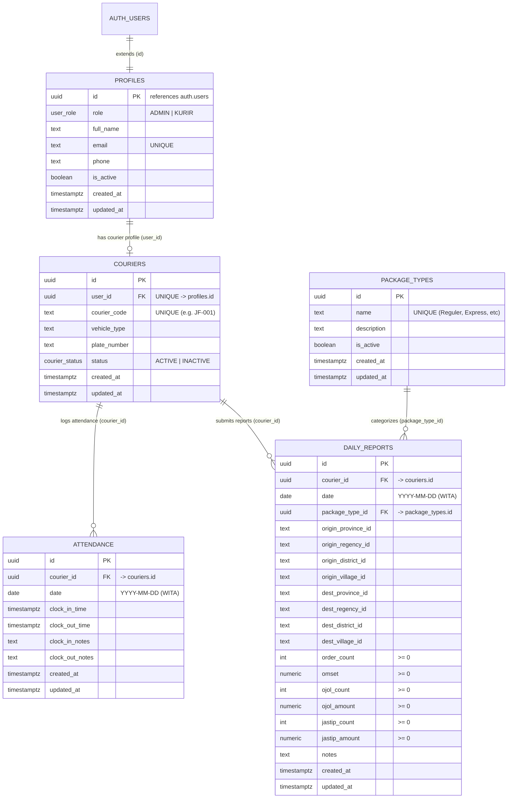

# ARSITEKTUR DATABASE — JETFOOD POLMAN
## Supabase PostgreSQL Schema & Security Design (Phase 1)

Dokumen ini memaparkan spesifikasi final skema database, pemetaan relasi antar entitas, strategi keamanan Row Level Security (RLS), constraint, indexing, serta manajemen rute dinamis untuk **JetFood Polman**.

---

### 1. Entity-Relationship Diagram (ERD)

---

### 2. Schema Final & Kamus Data

#### A. Tabel `public.profiles`
Menyimpan profil pengguna yang terhubung langsung dengan sistem autentikasi Supabase (`auth.users`).
* `id` (`uuid`, PK): Merujuk ke `auth.users(id)` dengan `ON DELETE CASCADE`.
* `role` (`user_role` ENUM): `'ADMIN'` atau `'KURIR'`. Default: `'KURIR'`.
* `full_name` (`text`, NOT NULL): Nama lengkap pengguna/kurir.
* `email` (`text`, NOT NULL, UNIQUE): Email login.
* `phone` (`text`, NULL): Nomor kontak WhatsApp/seluler.
* `is_active` (`boolean`, NOT NULL, Default: `true`): Status aktif. Jika `false`, akun dinonaktifkan tanpa merusak histori laporan.
* `created_at` / `updated_at` (`timestamptz`): Audit timestamp otomatis.

#### B. Tabel `public.couriers`
Menyimpan atribut operasional kurir lapangan.
* `id` (`uuid`, PK, Default: `gen_random_uuid()`): Identifier kurir.
* `user_id` (`uuid`, NOT NULL, UNIQUE, FK): Merujuk ke `profiles(id)` dengan `ON DELETE RESTRICT` (Mencegah penghapusan akun kurir yang memiliki data operasional).
* `courier_code` (`text`, NOT NULL, UNIQUE): Kode unik kurir (misal `JF-001`, `JF-002`).
* `vehicle_type` (`text`, NULL): Jenis kendaraan (Motor/Mobil).
* `plate_number` (`text`, NULL): Nomor plat kendaraan.
* `status` (`courier_status` ENUM, Default: `'ACTIVE'`): `'ACTIVE'` atau `'INACTIVE'`.

#### C. Tabel `public.package_types`
Master jenis paket yang dikelola sepenuhnya oleh Admin.
* `id` (`uuid`, PK, Default: `gen_random_uuid()`): ID jenis paket.
* `name` (`text`, NOT NULL, UNIQUE): Nama paket (misal: "Reguler", "Express", "Dokumen", "Cargo", "Makanan & Minuman").
* `description` (`text`, NULL): Keterangan paket.
* `is_active` (`boolean`, NOT NULL, Default: `true`): Status aktif jenis paket. Kurir hanya dapat memilih jenis paket yang aktif.

#### D. Tabel `public.attendance`
Mencatat presensi kurir harian dalam zona waktu WITA (`Asia/Makassar`).
* `id` (`uuid`, PK, Default: `gen_random_uuid()`): ID absensi.
* `courier_id` (`uuid`, NOT NULL, FK): Merujuk ke `couriers(id)` dengan `ON DELETE RESTRICT`.
* `date` (`date`, NOT NULL): Tanggal kalender operasional WITA (YYYY-MM-DD).
* `clock_in_time` (`timestamptz`, NOT NULL, Default: `now()`): Waktu absen masuk.
* `clock_out_time` (`timestamptz`, NULL): Waktu absen pulang.
* `clock_in_notes` / `clock_out_notes` (`text`, NULL): Catatan presensi masuk dan pulang.

#### E. Tabel `public.daily_reports`
Laporan aktivitas operasional kurir harian.
* `id` (`uuid`, PK, Default: `gen_random_uuid()`): ID laporan.
* `courier_id` (`uuid`, NOT NULL, FK): Merujuk ke `couriers(id)`.
* `date` (`date`, NOT NULL): Tanggal kalender operasional WITA.
* `package_type_id` (`uuid`, NOT NULL, FK): Merujuk ke `package_types(id)`.
* **Wilayah Keberangkatan (Origin):**
  - `origin_province_id` & `origin_province_name` (`text`, NOT NULL)
  - `origin_regency_id` & `origin_regency_name` (`text`, NOT NULL)
  - `origin_district_id` & `origin_district_name` (`text`, NOT NULL)
  - `origin_village_id` & `origin_village_name` (`text`, NOT NULL)
* **Wilayah Tujuan (Destination):**
  - `dest_province_id` & `dest_province_name` (`text`, NOT NULL)
  - `dest_regency_id` & `dest_regency_name` (`text`, NOT NULL)
  - `dest_district_id` & `dest_district_name` (`text`, NOT NULL)
  - `dest_village_id` & `dest_village_name` (`text`, NOT NULL)
* **Metrik Operasional:**
  - `order_count` (`integer`, NOT NULL, Default: 0)
  - `omset` (`numeric(12, 2)`, NOT NULL, Default: 0.00)
  - `ojol_count` (`integer`, NOT NULL, Default: 0)
  - `ojol_amount` (`numeric(12, 2)`, NOT NULL, Default: 0.00)
  - `jastip_count` (`integer`, NOT NULL, Default: 0)
  - `jastip_amount` (`numeric(12, 2)`, NOT NULL, Default: 0.00)
  - `notes` (`text`, NULL)

---

### 3. Model Rute Dinamis (Dynamic Route Architecture)
* **Tidak Ada Tabel Master Rute:** Tidak dibuat tabel statis yang menyimpan semua kombinasi rute.
* **Pembentukan Fleksibel:** Rute terbentuk dinamis dari pasangan *Wilayah Asal* dan *Wilayah Tujuan*.
* **Display vs Storage:** String rute (seperti `Manding, Polewali → Madatte, Polewali`) dihasilkan pada level aplikasi atau query view untuk kebutuhan UI dan rekap, bukan disimpan sebagai string mati di kolom tunggal. Hal ini menjamin fleksibilitas agregasi statistik per kecamatan, kelurahan, maupun kabupaten.

---

### 4. Constraint Strategy (Integritas Data)

1. **Pencegahan Absen Masuk Ganda:**
   `CONSTRAINT attendance_courier_date_unique UNIQUE (courier_id, date)`
   Menjamin seorang kurir hanya memiliki maksimal 1 baris presensi per hari kalender.
2. **Validasi Waktu Absen Pulang:**
   `CONSTRAINT attendance_clock_out_valid CHECK (clock_out_time IS NULL OR clock_out_time >= clock_in_time)`
   Menolak data jika waktu pulang tercatat lebih awal dari waktu masuk.
3. **Validasi Non-Negatif Metrik Operasional:**
   - `CHECK (order_count >= 0)`
   - `CHECK (omset >= 0.00)`
   - `CHECK (ojol_count >= 0)`
   - `CHECK (ojol_amount >= 0.00)`
   - `CHECK (jastip_count >= 0)`
   - `CHECK (jastip_amount >= 0.00)`
4. **Validasi Rute (Asal $\ne$ Tujuan):**
   `CONSTRAINT daily_reports_route_not_identical CHECK (origin_village_id <> dest_village_id)`
   Mencegah laporan dengan titik keberangkatan dan tujuan yang identik pada tingkat kelurahan/desa.
5. **Integritas Riwayat (Historical Protection):**
   Relasi foreign key ke kurir dan jenis paket menggunakan `ON DELETE RESTRICT`. Kurir atau jenis paket yang sudah memiliki transaksi laporan operasional tidak dapat dihapus paksa; melainkan dinonaktifkan (`is_active = false` atau `status = 'INACTIVE'`).

---

### 5. Index Strategy (Optimasi Performa)

| Tabel | Nama Index | Kolom | Tujuan |
| :--- | :--- | :--- | :--- |
| `profiles` | `idx_profiles_role` | `role` | Mempercepat evaluasi otorisasi & filter kurir vs admin |
| `profiles` | `idx_profiles_is_active` | `is_active` | Filter akun aktif |
| `couriers` | `idx_couriers_user_id` | `user_id` | Join cepat antara profil auth dan data kurir |
| `couriers` | `idx_couriers_status` | `status` | Filter status kerja kurir |
| `package_types` | `idx_package_types_active` | `is_active` | Mempercepat dropdown pemilihan paket aktif kurir |
| `attendance` | `idx_attendance_courier_date` | `(courier_id, date)` | Pencarian instan status presensi hari ini kurir |
| `attendance` | `idx_attendance_date` | `date` | Rekap kehadiran harian seluruh kurir oleh Admin |
| `daily_reports` | `idx_daily_reports_courier_date` | `(courier_id, date)` | Riwayat dan dashboard kurir |
| `daily_reports` | `idx_daily_reports_date` | `date` | Monitoring omset, order, dan rekap harian Admin |
| `daily_reports` | `idx_daily_reports_route_districts`| `(origin_district_name, dest_district_name)` | Agregasi statistik rute terpopuler antar kecamatan |
| `daily_reports` | `idx_daily_reports_route_villages` | `(origin_village_name, dest_village_name)` | Agregasi detail rute kelurahan/desa |

---

### 6. Row Level Security (RLS) Strategy

Untuk mengoptimalkan evaluasi RLS dan menghindari infinite recursion pada tabel `profiles`, skema menggunakan fungsi helper berlevel `SECURITY DEFINER`:
* `public.is_admin()`: Memeriksa apakah pemanggil adalah pengguna dengan `role = 'ADMIN'`.
* `public.get_auth_courier_id()`: Mengambil `couriers.id` yang terikat dengan pengguna yang sedang login (`auth.uid()`).

#### Matriks Hak Akses:

| Tabel | Aksi | Role ADMIN | Role KURIR | Catatan Keamanan |
| :--- | :---: | :---: | :---: | :--- |
| **`profiles`** | SELECT | Seluruh profil | Profil sendiri | Kurir tidak bisa melihat email kurir lain |
| | INSERT/UPDATE | Penuh | Hanya profil sendiri | Kurir tidak bisa mengubah role miliknya |
| **`couriers`** | SELECT | Seluruh kurir | Data kurir sendiri | Kurir hanya melihat identitasnya |
| | ALL (CRUD) | Penuh | Dilarang | Pembuatan dan update akun kurir mutlak milik Admin |
| **`package_types`**| ALL | Penuh | Hanya SELECT (`is_active = true`) | Kurir hanya dapat membaca opsi yang aktif |
| **`attendance`** | SELECT | Seluruh data | Data sendiri | Kurir memantau riwayat sendiri, Admin merekap semua |
| | INSERT | Penuh | Data sendiri | Kurir hanya absen atas namanya |
| | UPDATE | Penuh | Data sendiri | Kurir hanya mencatat jam pulang |
| **`daily_reports`**| SELECT | Seluruh laporan | Laporan sendiri | Kurir dilarang mengintip omset kurir lain |
| | INSERT | Penuh | Laporan sendiri | Diproteksi constraint tanggal & non-negatif |
| | UPDATE | Penuh | Laporan sendiri | Hanya pada record miliknya |
| | DELETE | Penuh | **Dilarang (Denied)** | Kurir tidak memiliki hak menghapus data transaksi |
